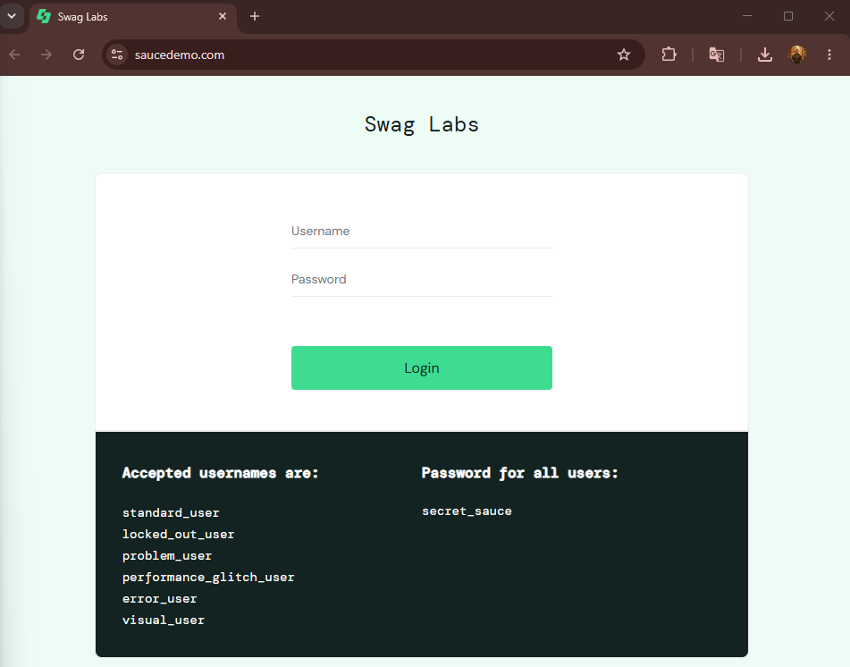
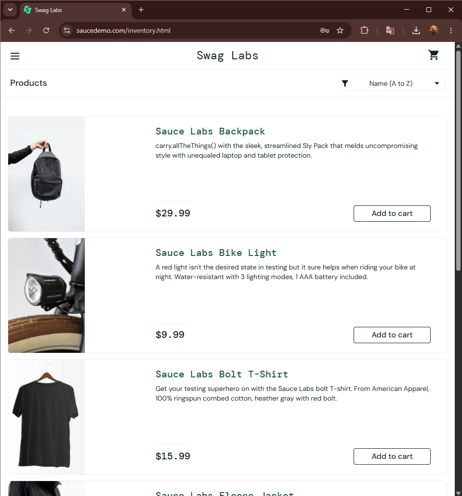
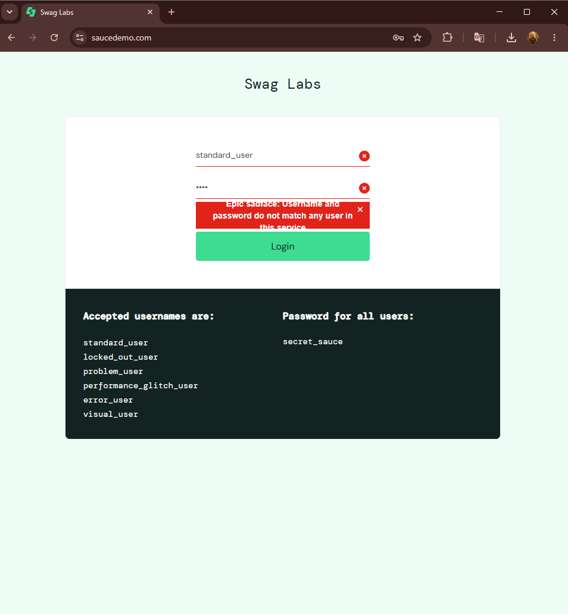
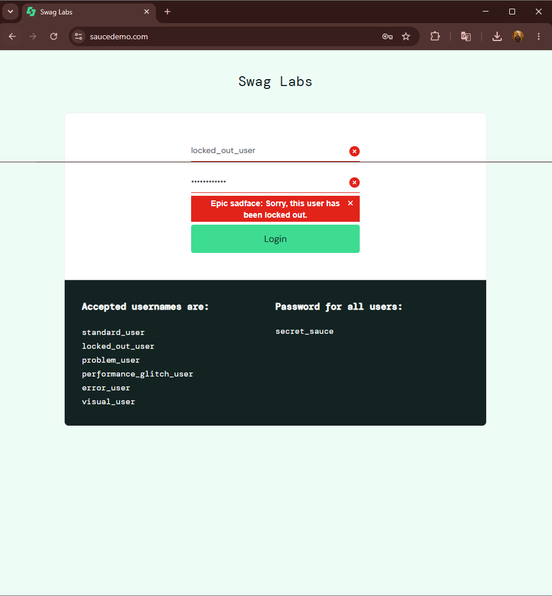

# Лабораторна робота № 2

## Проєктування тестів. Checklist, Test Cases та Decision Table

**Виконав:** Пацера Ігор Євгенійович  
**Група:** 6.1213-пі-2  

## Мета роботи

Навчитися визначати умови тестування на основі вимог, формувати checklist, описувати детальні позитивні та негативні test cases, застосовувати Decision Table для перевірки комбінацій облікових даних і фіксувати результати тестування.

## Тестовий об’єкт

Вебзастосунок SauceDemo: https://www.saucedemo.com/

## Тестове середовище

- Операційна система: Windows 11.
- Браузер: Google Chrome.
- Дата тестування: 07.09.2026.

## Test Basis

| ID | Вимога | Очікувана поведінка |
|---|---|---|
| TB-01 | Обов’язковий Username | Якщо Username порожній, авторизація не виконується, відображається `Epic sadface: Username is required`. |
| TB-02 | Обов’язковий Password | Якщо Username заповнений, а Password порожній, авторизація не виконується, відображається `Epic sadface: Password is required`. |
| TB-03 | Валідні облікові дані | Допустимі usernames: `standard_user`, `locked_out_user`, `problem_user`, `performance_glitch_user`, `error_user`, `visual_user`. Пароль для них: `secret_sauce`. |
| TB-04 | Успішний Login | За валідних облікових даних незаблокованого користувача виконується перехід до `/inventory.html`, сторінки Products. |
| TB-05 | Заблокований користувач | Для `locked_out_user` авторизація відхиляється з повідомленням `Epic sadface: Sorry, this user has been locked out`. |
| TB-06 | Невалідні credentials | Якщо Username або Password не відповідають допустимим даним, авторизація відхиляється з повідомленням `Epic sadface: Username and password do not match any user in this service`. |

## Test Conditions

На етапі Test Analysis визначено такі умови тестування:

1. **TCND-01** - успішна авторизація валідного незаблокованого користувача.
2. **TCND-02** - авторизація з неправильним Username.
3. **TCND-03** - авторизація з неправильним Password.
4. **TCND-04** - авторизація з порожнім Username.
5. **TCND-05** - авторизація з порожнім Password.
6. **TCND-06** - авторизація заблокованого користувача.

## Checklist

- [x] **TCND-01:** успішна авторизація з валідними даними та перехід на Products.
- [x] **TCND-02:** відмова в авторизації з неправильним Username.
- [x] **TCND-03:** відмова в авторизації з неправильним Password.
- [x] **TCND-04:** перевірка порожнього Username та повідомлення `Username is required`.
- [x] **TCND-05:** перевірка порожнього Password та повідомлення `Password is required`.
- [x] **TCND-06:** відмова в авторизації заблокованого користувача.

## Test Cases

### TC-LOGIN-01 - Успішна авторизація `standard_user`

| Поле | Значення |
|---|---|
| **ID** | TC-LOGIN-01 |
| **Title** | Успішна авторизація `standard_user` |
| **Type** | Positive |
| **Test Condition** | TCND-01 |
| **Preconditions** | Відкрита сторінка Login SauceDemo; користувач не авторизований. |
| **Test Data** | Username: `standard_user` Password: `secret_sauce` |
| **Steps** | 1. У поле Username ввести `standard_user`. 2. У поле Password ввести `secret_sauce`. 3. Натиснути кнопку Login. |
| **Expected Result** | Після введення валідних облікових даних і натискання Login користувач успішно авторизується та переходить на сторінку Products за адресою `/inventory.html`. |
| **Actual Result** | Після введення `standard_user` і `secret_sauce` та натискання Login відкрилася сторінка Products; URL змінився на `https://www.saucedemo.com/inventory.html`. |
| **Result** | **Pass** |

### TC-LOGIN-02 - Авторизація з неправильним Password

| Поле | Значення |
|---|---|
| **ID** | TC-LOGIN-02 |
| **Title** | Відмова в авторизації з неправильним Password |
| **Type** | Negative |
| **Test Condition** | TCND-03 |
| **Preconditions** | Відкрита сторінка Login SauceDemo; користувач не авторизований. |
| **Test Data** | Username: `standard_user` Password: `wrong_password` |
| **Steps** | 1. У поле Username ввести `standard_user`. 2. У поле Password ввести `wrong_password`. 3. Натиснути кнопку Login. |
| **Expected Result** | Авторизація відхиляється, перехід на Products не виконується, на сторінці Login відображається повідомлення `Epic sadface: Username and password do not match any user in this service`. |
| **Actual Result** | Авторизація не виконана; сторінка Login залишилася відкритою, відображено повідомлення `Epic sadface: Username and password do not match any user in this service`. |
| **Result** | **Pass** |

### TC-LOGIN-03 - Авторизація заблокованого користувача

| Поле | Значення |
|---|---|
| **ID** | TC-LOGIN-03 |
| **Title** | Відмова в авторизації заблокованого користувача |
| **Type** | Negative |
| **Test Condition** | TCND-06 |
| **Preconditions** | Відкрита сторінка Login SauceDemo; користувач не авторизований. |
| **Test Data** | Username: `locked_out_user` Password: `secret_sauce` |
| **Steps** | 1. У поле Username ввести `locked_out_user`. 2. У поле Password ввести `secret_sauce`. 3. Натиснути кнопку Login. |
| **Expected Result** | Авторизація відхиляється, перехід на Products не виконується, на сторінці Login відображається повідомлення `Epic sadface: Sorry, this user has been locked out`. |
| **Actual Result** | Авторизація не виконана; сторінка Login залишилася відкритою, відображено повідомлення `Epic sadface: Sorry, this user has been locked out`. |
| **Result** | **Pass** |

## Decision Table

Decision Table Testing використано для перевірки комбінацій Username, Password і стану користувача.

Дії:

- **A1** - перейти до Products;
- **A2** - показати повідомлення про заблокованого користувача;
- **A3** - показати повідомлення про неправильні credentials.

| Умови та дії | R1 | R2 | R3 | R4 | R5 |
|---|---:|---:|---:|---:|---:|
| Username входить до списку допустимих? | T | T | F | T | F |
| Password правильний? | T | T | T | F | F |
| Користувач заблокований? | F | T | - | - | - |
| **A1: Products** | X |  |  |  |  |
| **A2: Locked message** |  | X |  |  |  |
| **A3: Invalid credentials** |  |  | X | X | X |

### Опис правил

| Правило | Комбінація умов | Очікувана дія | Покриття test case |
|---|---|---|---|
| **R1** | Валідний Username + правильний Password + користувач не заблокований | Products | TC-LOGIN-01 |
| **R2** | Валідний Username + правильний Password + користувач заблокований | Повідомлення про блокування | TC-LOGIN-03 |
| **R3** | Невалідний Username + правильний Password | Повідомлення про неправильні credentials | ТС Немає |
| **R4** | Валідний Username + неправильний Password | Повідомлення про неправильні credentials | TC-LOGIN-02 |
| **R5** | Невалідний Username + неправильний Password | Повідомлення про неправильні credentials | TC Немає |

## Результати виконання

| Test Case | Type | Покрите правило | Expected / Actual | Result |
|---|---|---|---|---|
| TC-LOGIN-01 | Positive | R1 | Перехід на Products виконано | **Pass** |
| TC-LOGIN-02 | Negative | R4 | Відображено повідомлення про неправильні credentials | **Pass** |
| TC-LOGIN-03 | Negative | R2 | Відображено повідомлення про заблокованого користувача | **Pass** |

